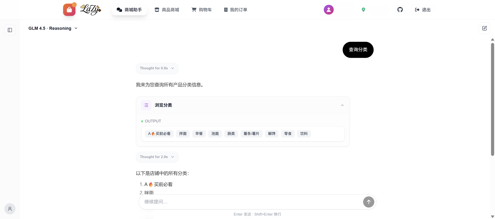
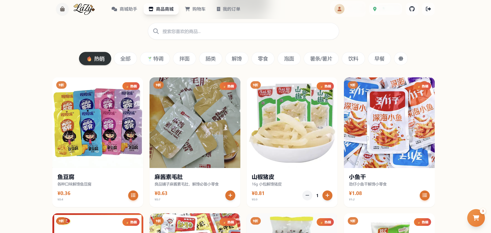
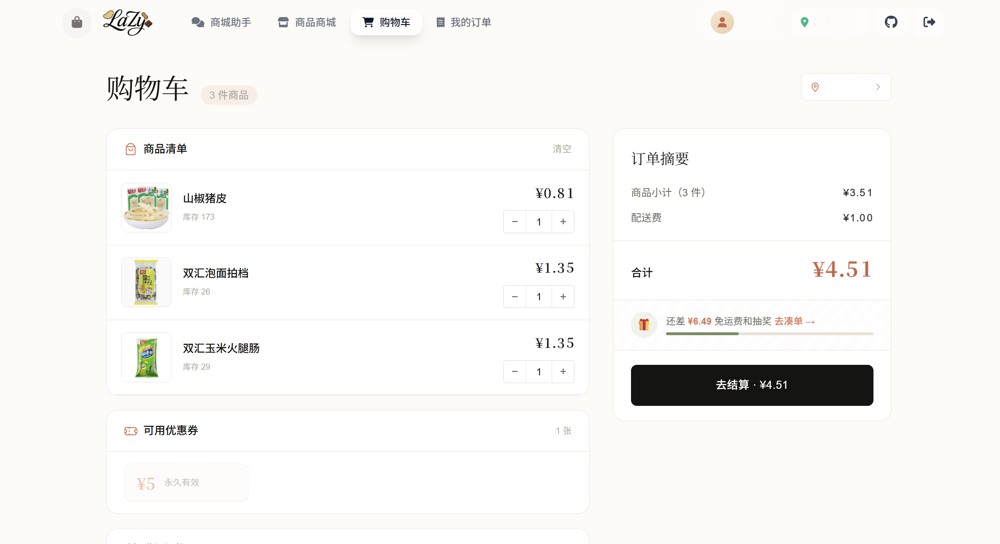
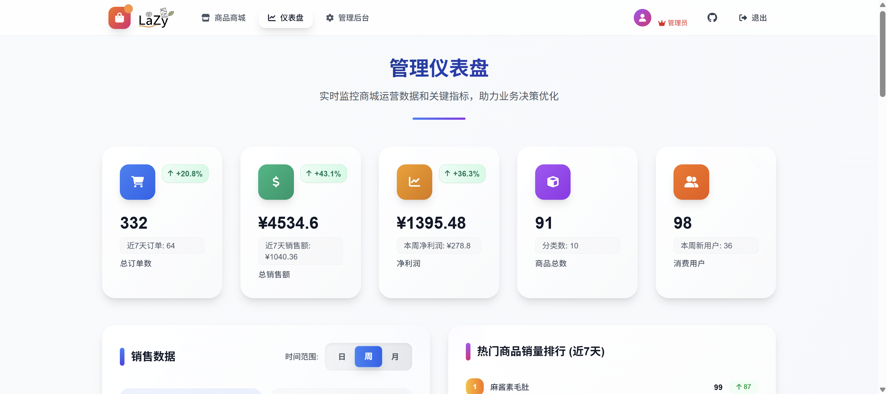
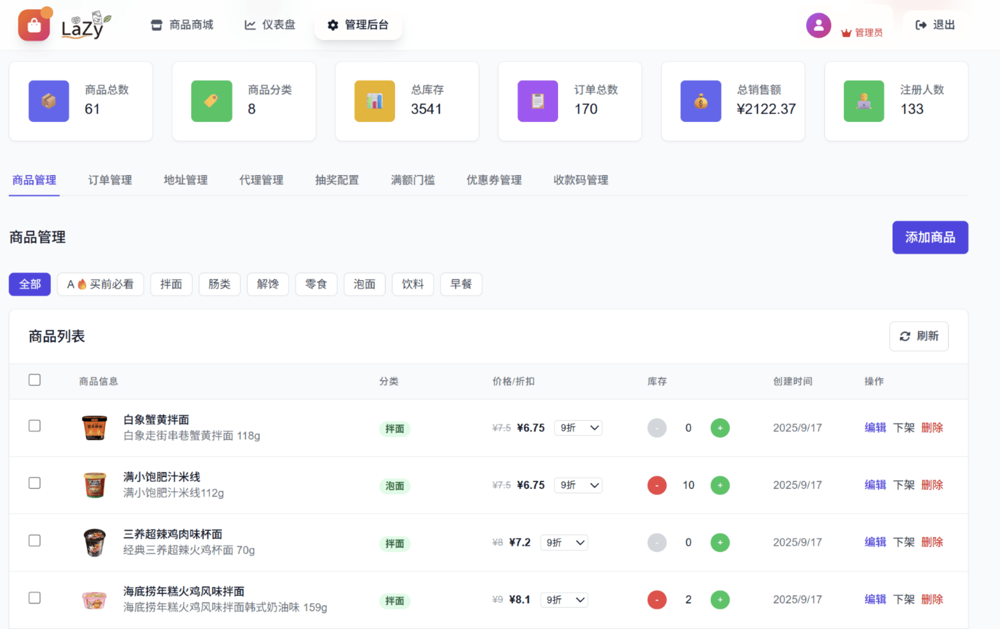
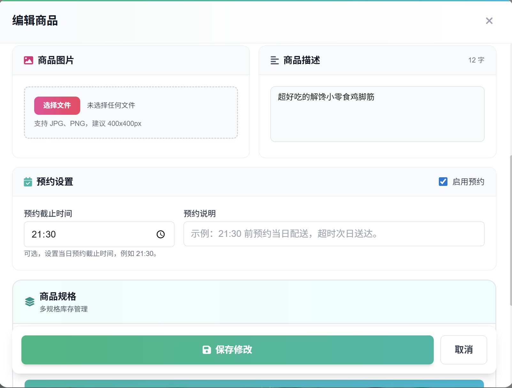

</think>

# 🛍️ 智慧商城系统

[](https://nextjs.org/)
[](https://fastapi.tiangolo.com/)
[](https://python.org/)
[](https://reactjs.org/)
[](https://typescriptlang.org/)
[](https://docker.com/)

<div align="center">


**现代化的智慧商城系统：集成 AI 购物助手、AI 管理助手、多角色权限、预约下单、完整电商闭环。**

[功能特性](#-功能特性) • [架构与技术栈](#-架构与技术栈) • [界面预览](#-界面预览) • [快速开始](#-快速开始) • [配置](#-配置) • [角色与后台](#-角色与后台) • [周期功能](#-周期功能) • [预约功能](#-预约功能) • [AI 能力](#-ai 能力) • [管理助手](#-管理助手) • [故障排除](#-故障排除)

</div>

## 📋 目录

* [🌟 功能特性](#-功能特性)
* [🏗️ 架构与技术栈](#-架构与技术栈)
* [📱 界面预览](#-界面预览)
* [🚀 快速开始](#-快速开始)

  * [环境要求](#环境要求)
  * [本地开发](#本地开发)
  * [Docker Compose 本地部署](#docker-compose-本地部署)
  * [GitHub Actions + Kubernetes 部署（推荐）](#github-actions--kubernetes-部署推荐)
* [🔧 配置](#-配置)
* [👥 角色与后台](#-角色与后台)
* [🔄 周期功能](#-周期功能)
* [📅 预约功能](#-预约功能)
* [🤖 AI 能力](#-ai 能力)
* [🧑‍💼 管理助手](#-管理助手)
* [🛡️ 故障排除](#-故障排除)
* [🤝 贡献](#-贡献)
* [📄 许可证](#-许可证)

---

## 🌟 功能特性

**核心体验**

* 🤖 AI 购物助手：基于 LLM 的咨询与推荐
* 🧑‍💼 AI 管理助手：管理员/代理商通过对话管理商品、订单、营销
* 🛒 购物流程：购物车、变体、批量操作、实时价计
* 🔎 搜索与分类：模糊检索 + 分类浏览
* 📅 预约下单：支持错峰配送与打烊预约
* 🎨 现代 UI：响应式

**后台与运营**

* 👑 多角色权限：超级管理员 / 管理员 / 代理商
* 📊 数据仪表盘：实时销售与业务分析
* 🔄 销售周期：开启/结束周期，仪表盘与订单按周期查看
* 🏪 商品管理：上架、库存、分类
* 🚚 配送策略：范围与费用灵活配置
* 💰 营销活动：满减、抽奖、智能赠品

**增值能力**

* 🎲 抽奖系统：订单满额自动抽奖
* 🎁 智能赠品：按订单金额自动发放
* 📅 预约系统：时间截止 + 打烊预约 + 商品预约
* 🏠 地址范围：楼栋/区域可配置
* 📈 分析洞察：销售趋势 & 用户行为

---

## 🏗️ 架构与技术栈

**整体架构**

* 前端：Next.js + React + TypeScript
* 后端：FastAPI，SQLite
* 鉴权：JWT + 角色/权限控制（RBAC）
* 部署：GitHub Actions 构建镜像，Kubernetes 管理生产工作负载

**主要技术**

* 前端：Next.js、React、TypeScript、Tailwind
* 后端：FastAPI、Python 3.11+
* 数据：SQLite（默认位于 `backend/data/dorm_shop.db`）
* 运维：Docker / Docker Compose / Kubernetes

---

## 📱 界面预览

### 用户端

<table>
<tr>
<td width="33%">
<h4>🏠 AI聊天助手</h4>

<p>智能购物助手，支持商品推荐和咨询</p>
</td>
<td width="33%">
<h4>🛍️ 商品商城</h4>

<p>商品展示和分类浏览界面</p>
</td>
<td width="33%">
<h4>🛒 购物车</h4>

<p>购物车管理和结算界面</p>
</td>
</tr>
</table>

### 管理端

<table>
<tr>
<td width="50%">
<h4>📊 管理仪表盘</h4>

<p>数据统计与业务分析</p>
</td>
<td width="50%">
<h4>📦 后台管理</h4>

<p>管理商品、订单等</p>
</td>
</tr>
</table>

---

## 🚀 快速开始

### 环境要求


本地开发推荐使用 Node.js 20 LTS、Python 3.11 或更高版本；本地容器验证需要包含 `docker compose` 命令的 Docker Compose v2。生产部署需要可用的 Kubernetes 集群及相应的集群管理或 GitOps 工具。

### 本地开发

1. **克隆项目**

```bash
git clone https://github.com/ystemsrx/smart-shop.git
cd smart-shop
```

仓库已内置 `public/logo-header.png`（顶部导航栏）和 `public/logo.jpg`（通用占位图），无需额外创建 `public` 目录。如需使用自定义图片，请将图片放入 `public` 目录，并在 `.env` 中修改 `HEADER_LOGO` 和 `LOGO`。

2. **环境配置**

具体请参考 [配置](#-配置) 部分。

Linux / macOS：

```bash
cp .env.example .env
```

Windows PowerShell：

```powershell
Copy-Item .env.example .env
```

然后按需修改 `.env`。本地开发默认使用其中的 `DEV_*` 地址连接本机后端。

3. **启动后端**

* **Linux**

```bash
cd backend
chmod +x start.sh
./start.sh
```

* **Windows**

进入 `backend` 目录双击 `start-backend.bat`，或在项目根目录运行：

```powershell
.\backend\start-backend.bat
```

4. **启动前端**

```bash
# 项目根目录
npm ci
npm run dev
```

Linux / macOS 如需以前端生产模式运行，可执行（后端仍需按上一步单独启动）：

```bash
# 构建并启动
npm run build
npm start
```

5. **访问服务**

* 前端：[http://localhost:3000](http://localhost:3000)
* 后端 API：[http://localhost:9099](http://localhost:9099)
* 管理后台：[http://localhost:3000/admin](http://localhost:3000/admin)

### Docker Compose 本地部署

Docker Compose 用于本机或单机环境验证，不作为推荐的生产发布方式。先按 [配置](#-配置) 部分准备 `.env`。默认 Logo 已包含在仓库中，无需额外复制图片；如需自定义 Logo，请在首次构建前完成配置。

```bash
# 构建并启动
docker compose up -d --build

# 查看日志
docker compose logs -f

# 停止服务
docker compose down
```

当前 Compose 配置默认从本地源码构建镜像；生产环境使用下面的 GitHub Actions + Kubernetes 流程。

### GitHub Actions + Kubernetes 部署（推荐）

仓库通过 [`.github/workflows/publish.yml`](.github/workflows/publish.yml) 验证代码，并将前后端镜像发布到腾讯云容器镜像服务（TCR）。

推荐发布链路为：`master` → GitHub Actions 验证和构建 → TCR 不可变镜像 → Kubernetes 更新 Deployment → 健康检查与滚动发布。当前工作流负责验证及发布镜像，不会直接连接或修改 Kubernetes 集群；镜像上线由集群管理平台或 GitOps 流程完成。本仓库不包含通用 Kubernetes 清单，Deployment、Service、PVC 和 Ingress 应由实际部署环境的运维仓库或集群平台管理。

#### 工作流程

| 触发方式 | 验证 | 发布镜像 |
| --- | --- | --- |
| 创建或更新 Pull Request | 前端执行 `npm ci`、`npm run build`；后端通过 `uv` 安装依赖、运行测试并构建后端镜像 | 否 |
| 推送到 `master` | 完成全部前后端验证 | 是 |
| 在 Actions 页面手动运行 `workflow_dispatch` | 验证所选分支 | 是 |

发布任务只有在前后端验证全部通过后才会执行。Pull Request 不登录 TCR，因此不需要访问发布用的 Secrets。

#### 发布前准备

工作流当前固定使用以下镜像仓库：

```text
ccr.ccs.tencentyun.com/lazycampus/smart-shop-backend
ccr.ccs.tencentyun.com/lazycampus/smart-shop-frontend
```

请先在 TCR 中确认 `lazycampus` 命名空间及两个镜像仓库可用，并确保发布账号拥有推送权限。如果需要使用其他地域、命名空间或仓库名称，请同步修改工作流中的 `REGISTRY` 和镜像标签。

然后进入 GitHub 仓库的 **Settings → Secrets and variables → Actions** 完成以下配置。

**Repository secrets**

| 名称 | 是否必需 | 说明 |
| --- | --- | --- |
| `TCR_USERNAME` | 发布时必需 | TCR 登录用户名 |
| `TCR_PASSWORD` | 发布时必需 | TCR 登录密码或访问凭证；必须存放在 Secret 中 |

**Repository variables**

| 名称 | 是否必需 | 示例或说明 |
| --- | --- | --- |
| `NEXT_PUBLIC_API_URL` | 必需 | `https://shop-api.example.com` |
| `NEXT_PUBLIC_IMAGE_BASE_URL` | 必需 | 通常与 API 地址相同 |
| `NEXT_PUBLIC_FILE_BASE_URL` | 必需 | 通常与 API 地址相同 |
| `SHOP_NAME` | 必需 | 前端显示的商城名称 |
| `HEADER_LOGO` | 建议配置 | 使用内置资源时填写 `logo-header.png` |
| `LOGO` | 建议配置 | 使用内置资源时填写 `logo.jpg` |

前四个变量缺失时，Pull Request 的验证构建仍可能通过，但正式发布阶段的前端生产构建会因配置不完整而失败。Logo 变量不是敏感信息，应配置为 Variables，而不是 Secrets。

#### 镜像标签

每次成功发布都会生成两类不可变标签：

```text
1.0.<GitHub Actions run number>
sha-<完整 Git commit SHA>
```

工作流不会发布 `latest` 标签。部署时建议固定 `sha-*` 标签以保证版本可追溯，或固定明确的 `1.0.*` 版本标签。

#### Kubernetes 部署要求

GitHub Actions 发布成功后，在 Kubernetes 中将前后端 Deployment 更新到同一次构建产生的镜像标签。以下命令仅展示更新方式，请替换命名空间、Deployment 名称和完整 Git SHA：

```bash
kubectl -n <namespace> set image deployment/<backend-deployment> \
  backend=ccr.ccs.tencentyun.com/lazycampus/smart-shop-backend:sha-<git-sha>

kubectl -n <namespace> set image deployment/<frontend-deployment> \
  frontend=ccr.ccs.tencentyun.com/lazycampus/smart-shop-frontend:sha-<git-sha>

kubectl -n <namespace> rollout status deployment/<backend-deployment>
kubectl -n <namespace> rollout status deployment/<frontend-deployment>
```

集群侧至少需要准备：

* 前端 Deployment 与 Service，容器端口为 `3000`
* 后端 Deployment 与 Service，容器端口为 `9099`，存活/就绪探针可使用 `/healthz`
* 私有 TCR 所需的 `imagePullSecrets`，并绑定到两个 Deployment 或其 ServiceAccount
* 后端持久卷，至少持久化 `/app/backend/data`、`/app/backend/items`、`/app/backend/exports` 和运行时文件目录 `/app/public`
* 后端容器以 UID/GID `10001` 的非 root 用户运行，挂载卷必须允许该用户写入；可通过存储权限或 Pod `securityContext` 配置
* 后端运行时 ConfigMap/Secret，以及面向前后端域名的 Ingress 或网关配置

默认数据库为 SQLite，因此后端 Deployment 应保持单副本，不能让多个 Pod 同时写入同一个 SQLite 文件。需要水平扩容前，应先完成支持多实例访问的数据库架构改造。

若使用 Argo CD、Flux 等 GitOps 工具，应在部署仓库中更新镜像标签并由 GitOps 控制器同步，不需要向本仓库的 GitHub Actions 提供 Kubernetes 凭证。回滚时将 Deployment 或部署仓库恢复到上一个 `sha-*` 标签即可。

#### 运行时敏感配置

`API_KEY`、`JWT_SECRET_KEY`、管理员密码及数据库、Redis 凭证不参与镜像构建，也不需要添加到上述 GitHub Actions 配置中。发布后的后端容器必须通过 Kubernetes Secret 或外部密钥管理系统在运行时注入这些值，避免将真实凭证写入镜像或构建日志。

`NEXT_PUBLIC_*`、`SHOP_NAME` 和 Logo 文件名属于前端构建配置，会在 GitHub Actions 构建镜像时写入前端产物；修改这些值后必须重新构建并发布前端镜像，仅修改 Kubernetes Deployment 的环境变量不会更新已构建的浏览器端配置。

---

## 🔧 配置

复制 `.env.example` 为 `.env` 并根据需要调整：

```env
# ==================================================
# 智能小商城 - 环境配置示例文件
# ==================================================
# 复制此文件为 .env 并修改相应配置

# 运行环境（development 或 production）
ENV=development
# 商城名称
SHOP_NAME=你的商城名称

# JWT 认证配置
JWT_SECRET_KEY=your_jwt_secret_key_here_please_change_this
JWT_ALGORITHM=HS256
# 用户访问令牌过期时间（天）
ACCESS_TOKEN_EXPIRE_DAYS=30

# 管理员配置 (可一个或多个，用逗号分隔)
ADMIN_USERNAME=admin1,admin2
ADMIN_PASSWORD=your_admin_password1,your_admin_password2

# AI 配置
API_KEY=your_api_key
API_URL=https://openrouter.ai/api/v1
# 模型列表、显示名称、启用状态与思考能力请在“管理后台 → AI 模型”中配置

# 第三方登录 API (可选)
LOGIN_API=https://your-login-api.com
LOGIN_API_TOKEN=replace-with-a-service-token

# 统一身份会话（可选；前五个 OIDC 字段需成组配置）
OIDC_ISSUER=https://auth.example.com/realms/example
OIDC_CLIENT_ID=smart-shop
OIDC_CLIENT_SECRET=replace-with-client-secret
OIDC_REDIRECT_URI=https://shop-api.example.com/auth/oidc/callback
OIDC_FRONTEND_URL=https://shop.example.com
# 使用 Keycloak 身份代理时可指定上游 IdP；其他 OIDC 服务可省略
OIDC_IDP_HINT=campus

# Redis 配置 (可选)
REDIS_URL=redis://localhost:6379/0

# 后端服务器配置
BACKEND_HOST=0.0.0.0
BACKEND_PORT=9099
LOG_LEVEL=INFO

# 数据库配置
DB_PATH=data/dorm_shop.db
# 是否重置数据库（1：是，0：否）
DB_RESET=0

# 前端配置
NEXT_PUBLIC_API_URL=https://your-api-domain.com
NEXT_PUBLIC_IMAGE_BASE_URL=https://your-api-domain.com
NEXT_PUBLIC_FILE_BASE_URL=https://your-api-domain.com

# CORS 配置 (多个域名用逗号分隔)
ALLOWED_ORIGINS=https://your-frontend-domain.com,http://localhost:3000

# 静态文件缓存配置 (秒)
STATIC_CACHE_MAX_AGE=2592000

# Logo 配置（图片文件需放在 public 目录下）
# 网页顶部导航栏 logo 图片文件名
HEADER_LOGO=logo-header.png
# 通用占位 logo（用于商品图片加载失败等情况）
LOGO=logo.jpg

# 开发环境配置（仅开发时使用，即 ENV=development 时生效）
DEV_NEXT_PUBLIC_API_URL=http://localhost:9099
DEV_NEXT_PUBLIC_IMAGE_BASE_URL=http://localhost:9099
DEV_NEXT_PUBLIC_FILE_BASE_URL=http://localhost:9099
DEV_BACKEND_HOST=localhost
DEV_LOG_LEVEL=DEBUG

# 密码加密配置（默认启用，使用 bcrypt 加密存储密码）
ENABLE_PASSWORD_HASH=1
```

统一身份配置是可选能力。不配置 OIDC 时，原登录框、管理员登录和本地会话均保持原样；同时配置兼容登录 API 与 OIDC 后，用户仍只使用原登录框，成功后由浏览器自动完成一次会话衔接并返回商城，不需要额外按钮或再次输入。

启动服务并登录管理后台后，在“AI 模型”页面逐项添加模型。排序最靠前的已启用模型是默认模型；模型可独立停用而不必删除。调整顺序、启用状态或思考能力后会自动保存并立即生效，无需重启后端。旧版本 `.env` 中的 `MODEL`、`MODEL_NAME` 与 `SUPPORTS_THINKING` 会在升级后首次启动时自动导入数据库。

其中“第三方登录”部分需要填写你自己的登录服务 API 地址，该系统会向目标 API 地址发送如下格式的请求以验证用户身份，请自行调整以符合你的登录服务要求。

```
payload = {
    "account": {id},
    "password": {password}
}
```

第三方 API 登陆成功期望返回格式示例：

```json
{
  "success": true,
  "code": 200,
  "data": {
    "name": "王小明",
    "accountId": "0101010101",
    "avatarUrl": "",
    "idNumber": "510123199901011234"
  }
}
```

---

## 👥 角色与后台

**普通用户**

* 浏览/搜索、AI 助手咨询、购物车、下单/跟踪

**代理商（Agent）**

* 商品上架、订单处理与发货、代理区域、营业状态、销售数据

**管理员（Admin）**

* 拥有代理商全部权限；平台级数据与全局配置

**管理后台能力**

* 销售统计（今日/周/月）、热销排行、用户活跃度、代理商业绩
* 订单全链路（状态/物流/支付/详情）

---

## 🔄 周期功能

周期用于把业务数据按阶段拆分，便于回顾与对比。管理员与代理都可以管理周期，并在仪表盘/订单中切换视图。

**支持能力**

* 手动开启/结束周期，记录每个周期的起止时间
* 仪表盘、订单支持“全部周期 / 指定周期”查看，当前周期会显示进行中标识
* 结束周期会锁定营业状态，需要撤销结束或开启新周期后才能切换营业状态

---

## 📅 预约功能

预约系统是本商城系统的特色功能，支持错峰配送和打烊预约，让用户可以提前下单，代理商可以更灵活地安排配送。

### 预约触发方式

系统支持三种预约触发方式，可灵活组合使用：

**1. 商品级预约**

* 商品设置为"需要预约"时，无论店铺是否营业，该商品都只能通过预约方式购买
* 适用场景：需要提前准备的商品（如定制商品、限量商品等）

**2. 时间截止预约**

* 商品可设置"预约截止时间"（如 14:00）
* 超过该时间下单会自动转为预约订单，配送时间延后至次日或指定时间
* 适用场景：当日配送商品，错峰配送

**示例：**  


**3. 打烊预约**

* 代理商可设置营业/打烊状态
* 打烊期间，若开启"预约下单"功能，用户可提交预约订单
* 代理商营业后可批量处理预约订单
* 适用场景：非营业时间接单、节假日预订

### 用户端使用

**查看预约信息**

* 商品卡片会显示预约标识和说明
* 带有时间截止的商品会显示"今日 XX:XX 后配送"
* 打烊时会提示"店铺已暂停营业"及是否支持预约

**下单流程**

1. 将商品加入购物车（预约商品会有特殊标识）
2. 进入结算页面，系统自动显示预约提示
3. 填写收货信息并提交订单
4. 预约订单会标记为"预约订单"，在订单列表中可查看

**订单查询**

* 订单列表中预约订单会显示预约标识
* 可查看预约原因（时间截止、店铺打烊、商品预约等）
* 确认后会转为正常订单流程

---

## 🤖 AI 能力

本系统集成 **OpenAI** 兼容的 AI 助手（建议在 [OpenRouter](https://openrouter.ai/) 申请 API Key 并将接口地址配置到 `.env` 中）。

**AI 功能**

* 🎯 商品推荐
* 🛒 购物助手
* 💬 自然对话
* 🔧 工具调用（实时查询/操作）

**用户端工具**

| 工具                | 说明      | 权限  |
| ----------------- | ------- | --- |
| `search_products` | 商品搜索/浏览 | 公开  |
| `get_category`    | 分类获取    | 公开  |
| `update_cart`     | 购物车增删改  | 需登录 |
| `get_cart`        | 查看购物车   | 需登录 |

**管理端工具**（详见 [管理助手](#-管理助手)）

| 工具 | 说明 | 权限 |
| --- | --- | --- |
| `manage_products` | 商品增删改查与变体管理 | 管理员/代理商 |
| `manage_orders` | 订单查询与状态更新 | 管理员/代理商 |
| `manage_lottery` | 抽奖配置与奖品管理 | 管理员/代理商 |
| `manage_thresholds` | 满赠阈值配置 | 管理员/代理商 |
| `manage_coupons` | 优惠券发放与撤回 | 管理员/代理商 |
| `search_users` | 用户搜索与信息查看 | 管理员/代理商 |

---

## 🧑‍💼 管理助手

管理助手是面向管理员和代理商的 AI 对话式运营工具，可通过自然语言完成商品、订单、营销等日常管理操作，无需逐一进入后台页面手动操作。

访问路径：`/admin/ai-chat`（管理员）、`/agent/ai-chat`（代理商）

### 核心能力

管理助手集成了 **6 大管理工具**，AI 可根据对话内容自动调用：

| 工具 | 功能 | 支持操作 |
| --- | --- | --- |
| `manage_products` | 商品管理 | 分类查看、商品搜索/列表、新增、批量编辑、批量删除、变体/规格管理 |
| `manage_orders` | 订单管理 | 按状态/用户/订单号筛选查询、批量更新订单状态 |
| `manage_lottery` | 抽奖配置 | 查看/修改抽奖设置、新增/编辑/删除奖品 |
| `manage_thresholds` | 满赠配置 | 查看/新增/编辑/删除满额赠品和优惠券阈值 |
| `manage_coupons` | 优惠券管理 | 查看优惠券、批量发放/撤回优惠券 |
| `search_users` | 用户查询 | 按 ID/姓名/手机号搜索用户、查看用户订单/优惠券 |

### 对话示例

```
管理员: 帮我把"草莓蛋糕"的价格改成 28 元，库存设为 50
助手:   已将"草莓蛋糕"价格修改为 28.00 元，库存更新为 50。

管理员: 查一下今天有多少待发货的订单
助手:   当前有 12 笔待发货订单，需要我帮你批量更新为配送中吗？

管理员: 给用户 1001 发 3 张 5 元优惠券，7 天后过期
助手:   已为用户 1001 发放 3 张面额 5.00 元的优惠券，有效期至 2026-04-08。
```

### 特色功能

* **流式响应**：基于 SSE 实时输出 AI 回复，支持思维链展示
* **多模型切换**：在对话界面切换不同 LLM 模型
* **图片上传**：对话中上传图片用于商品添加/编辑（自动转换 WebP 格式）
* **对话持久化**：每个管理员/代理商拥有独立的对话记录，支持多轮对话和历史查看
* **角色隔离**：代理商仅能操作其管辖区域内的商品和订单，管理员拥有全局权限

---

## 🛡️ 故障排除

**1) 服务端口被占用**

* **Windows**

```bat
netstat -ano | findstr :3000
netstat -ano | findstr :9099
REM 记下 PID 后：
taskkill /PID <PID> /F
```

* **Linux**

```bash
lsof -i :3000
lsof -i :9099
kill -9 <PID>
```

> 也可改端口：

```bash
export FRONTEND_PORT=3001
export BACKEND_PORT=9100
```

**2) 数据库异常**

```bash
# 权限检查
ls -la backend/data/dorm_shop.db
# 重新初始化
cd backend && python init_db.py
```

**3) AI 配置错误**

```bash
# 检查环境变量
echo $API_KEY
echo $API_URL
# 编辑 .env 重新加载
```

**4) 图片上传失败**

```bash
# 目录权限
chmod 755 backend/items/ backend/public/
# 清理缓存
rm -rf backend/__pycache__
```

---

## 🤝 贡献

欢迎 Issue / PR！

---

## 📄 许可证

本项目采用 **Apache 2.0**。详见 [LICENSE](LICENSE)。

---

<div align="center">

**如果这个项目对你有帮助，欢迎点一个 ⭐️ 支持！**  
[🐛 提交问题](https://github.com/ystemsrx/smart-shop/issues) • [💡 功能建议](https://github.com/ystemsrx/smart-shop/discussions)

</div>
