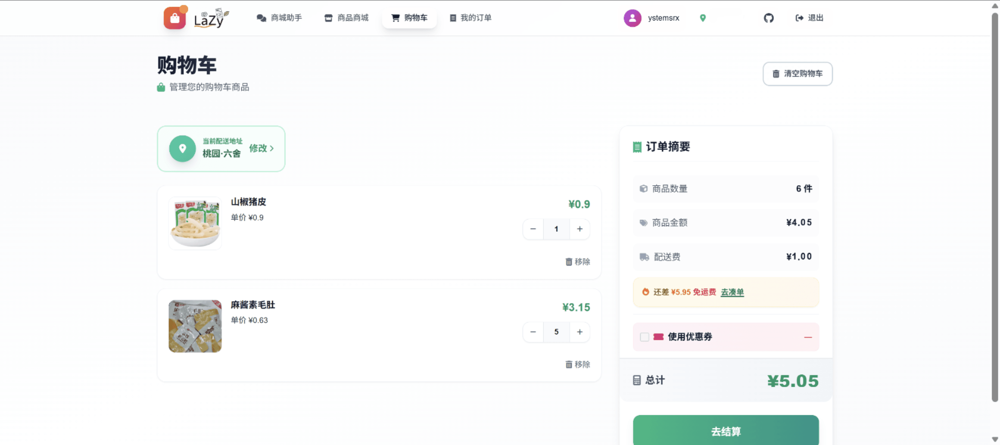
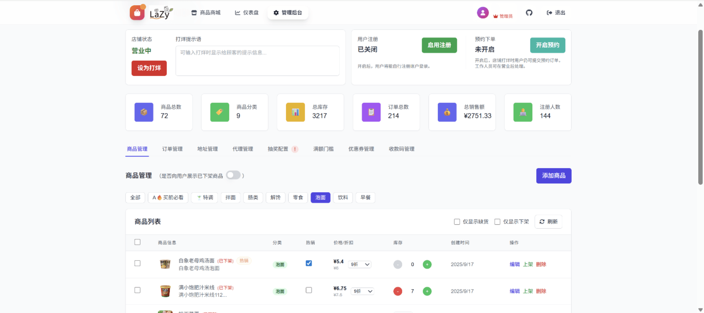

# 🛍️ 智慧商城系统

[](https://nextjs.org/)
[](https://fastapi.tiangolo.com/)
[](https://python.org/)
[](https://reactjs.org/)
[](https://typescriptlang.org/)
[](https://docker.com/)

<div align="center">


**现代化的智慧商城系统：集成 AI 购物助手、多角色权限、预约下单、完整电商闭环。**

[功能特性](#-功能特性) • [架构与技术栈](#-架构与技术栈) • [界面预览](#-界面预览) • [快速开始](#-快速开始) • [配置](#-配置) • [角色与后台](#-角色与后台) • [预约功能](#-预约功能) • [AI 能力](#-ai-能力) • [故障排除](#-故障排除)

</div>

## 📋 目录

* [🌟 功能特性](#-功能特性)
* [🏗️ 架构与技术栈](#-架构与技术栈)
* [📱 界面预览](#-界面预览)
* [🚀 快速开始](#-快速开始)

  * [环境要求](#环境要求)
  * [本地开发](#本地开发)
  * [Docker 部署（推荐）](#docker-部署推荐)
* [🔧 配置](#-配置)
* [👥 角色与后台](#-角色与后台)
* [📅 预约功能](#-预约功能)
* [🤖 AI 能力](#-ai-能力)
* [🛡️ 故障排除](#-故障排除)
* [🤝 贡献](#-贡献)
* [📄 许可证](#-许可证)

---

## 🌟 功能特性

**核心体验**

* 🤖 AI 购物助手：基于 LLM 的咨询与推荐
* 🛒 购物流程：购物车、变体、批量操作、实时价计
* 🔎 搜索与分类：模糊检索 + 分类浏览
* 📅 预约下单：支持错峰配送与打烊预约
* 🎨 现代 UI：响应式

**后台与运营**

* 👑 多角色权限：超级管理员 / 管理员 / 代理商
* 📊 数据仪表盘：实时销售与业务分析
* 🏪 商品管理：上架、库存、分类
* 🚚 配送策略：范围与费用灵活配置
* 💰 营销活动：满减、抽奖、智能赠品

**增值能力**

* 🎲 抽奖系统：订单满额自动抽奖
* 🎁 智能赠品：按订单金额自动发放
* 📅 预约系统：时间截止 + 打烊预约 + 商品预约
* 🏠 地址范围：楼栋/区域可配置
* 📈 分析洞察：销售趋势 & 用户行为

---

## 🏗️ 架构与技术栈

**整体架构**

* 前端：Next.js + React + TypeScript
* 后端：FastAPI，SQLite
* 鉴权：JWT + 角色/权限控制（RBAC）
* 部署：Docker Compose 一键化

**主要技术**

* 前端：Next.js、React、TypeScript、Tailwind
* 后端：FastAPI、Python 3.12（建议）
* 数据：SQLite（默认位于 `backend/dorm_shop.db`）
* 运维：Docker / docker-compose

---

## 📱 界面预览

### 用户端

<table>
<tr>
<td width="33%">
<h4>🏠 AI聊天助手</h4>

<p>智能购物助手，支持商品推荐和咨询</p>
</td>
<td width="33%">
<h4>🛍️ 商品商城</h4>

<p>商品展示和分类浏览界面</p>
</td>
<td width="33%">
<h4>🛒 购物车</h4>

<p>购物车管理和结算界面</p>
</td>
</tr>
</table>

### 管理端

<table>
<tr>
<td width="50%">
<h4>📊 管理仪表盘</h4>

<p>数据统计与业务分析</p>
</td>
<td width="50%">
<h4>📦 商品管理</h4>

<p>上架/编辑/库存管理</p>
</td>
</tr>
</table>

---

## 🚀 快速开始

### 环境要求


### 本地开发

1. **克隆项目**

```bash
git clone https://github.com/ystemsrx/smart-shop.git
cd smart-shop

# 创建必要文件夹并放置商店logo图片
msdir public
cp /path/to/your/logo.png public/logo.png
```

2. **环境配置**

具体请参考 [配置](#-配置) 部分。

```bash
cp .env.example .env
# 按需修改 .env
```

3. **启动后端**

* **Linux**

```bash
cd backend
chmod +x start.sh
./start.sh
```

* **Windows**

进入 `backend` 目录双击 `start.bat`

4. **启动前端**

```bash
# 项目根目录
npm install
npm run dev
```

生产环境可直接：

```bash
chmod +x run.sh
./run.sh
```

5. **访问服务**

* 前端：[http://localhost:3000](http://localhost:3000)
* 后端 API：[http://localhost:9099](http://localhost:9099)
* 管理后台：[http://localhost:3000/admin](http://localhost:3000/admin)

### Docker 部署（推荐）

参考 [配置](#-配置) 部分

修改 `.env` 文件并将商店 logo 图片（logo.png）放进public文件夹后：

```bash
# 构建并启动
docker-compose up -d

# 查看日志
docker-compose logs -f

# 停止并清理
docker-compose down
```

---

## 🔧 配置

复制 `.env.example` 为 `.env` 并根据需要调整：

```env
# ==================================================
# 智能小商城 - 环境配置示例文件
# ==================================================
# 复制此文件为 .env 并修改相应配置

# 运行环境（development 或 production）
ENV=development
# 商城名称
SHOP_NAME=你的商城名称

# JWT 认证配置
JWT_SECRET_KEY=your_jwt_secret_key_here_please_change_this
JWT_ALGORITHM=HS256
# 用户访问令牌过期时间（天）
ACCESS_TOKEN_EXPIRE_DAYS=30

# 管理员配置 (可一个或多个，用逗号分隔)
ADMIN_USERNAME=admin1,admin2
ADMIN_PASSWORD=your_admin_password1,your_admin_password2

# AI 配置
API_KEY=your_api_key
API_URL=https://openrouter.ai/api/v1
MODEL=openai/gpt-oss-20b:free,z-ai/glm-4.5-air:free
MODEL_NAME=GPT-OSS,GLM 4.5
# 支持思维链的模型（可选，需在 MODEL 中已配置）
SUPPORTS_THINKING=openai/gpt-oss-20b:free,z-ai/glm-4.5-air:free

# 第三方登录 API (可选)
LOGIN_API=https://your-login-api.com

# 后端服务器配置
BACKEND_HOST=0.0.0.0
BACKEND_PORT=9099
LOG_LEVEL=INFO

# 数据库配置
DB_PATH=dorm_shop.db
# 是否重置数据库（1：是，0：否）
DB_RESET=0

# 前端配置
NEXT_PUBLIC_API_URL=https://your-api-domain.com
NEXT_PUBLIC_IMAGE_BASE_URL=https://your-api-domain.com
NEXT_PUBLIC_FILE_BASE_URL=https://your-api-domain.com

# CORS 配置 (多个域名用逗号分隔)
ALLOWED_ORIGINS=https://your-frontend-domain.com,http://localhost:3000

# 静态文件缓存配置 (秒)
STATIC_CACHE_MAX_AGE=2592000

# 开发环境配置（仅开发时使用，即 ENV=development 时生效）
DEV_NEXT_PUBLIC_API_URL=http://localhost:9099
DEV_NEXT_PUBLIC_IMAGE_BASE_URL=http://localhost:9099
DEV_NEXT_PUBLIC_FILE_BASE_URL=http://localhost:9099
DEV_BACKEND_HOST=localhost
DEV_LOG_LEVEL=DEBUG
```

其中“第三方登录”部分需要填写你自己的登录服务 API 地址，该系统会向目标 API 地址发送如下格式的请求以验证用户身份，请自行调整以符合你的登录服务要求。

```
payload = {
    "account": {id},
    "password": {password}
}
```

---

## 👥 角色与后台

**普通用户**

* 浏览/搜索、AI 助手咨询、购物车、下单/跟踪

**代理商（Agent）**

* 商品上架、订单处理与发货、代理区域、营业状态、销售数据

**管理员（Admin）**

* 拥有代理商全部权限；平台级数据与全局配置

**管理后台能力**

* 销售统计（今日/周/月）、热销排行、用户活跃度、代理商业绩
* 订单全链路（状态/物流/支付/详情）

---

## 📅 预约功能

预约系统是本商城系统的特色功能，支持错峰配送和打烊预约，让用户可以提前下单，代理商可以更灵活地安排配送。

### 预约触发方式

系统支持三种预约触发方式，可灵活组合使用：

**1. 商品级预约**

* 商品设置为"需要预约"时，无论店铺是否营业，该商品都只能通过预约方式购买
* 适用场景：需要提前准备的商品（如定制商品、限量商品等）

**2. 时间截止预约**

* 商品可设置"预约截止时间"（如 14:00）
* 超过该时间下单会自动转为预约订单，配送时间延后至次日或指定时间
* 适用场景：当日配送商品，错峰配送

**示例：**  


**3. 打烊预约**

* 代理商可设置营业/打烊状态
* 打烊期间，若开启"预约下单"功能，用户可提交预约订单
* 代理商营业后可批量处理预约订单
* 适用场景：非营业时间接单、节假日预订

### 用户端使用

**查看预约信息**

* 商品卡片会显示预约标识和说明
* 带有时间截止的商品会显示"今日 XX:XX 后配送"
* 打烊时会提示"店铺已暂停营业"及是否支持预约

**下单流程**

1. 将商品加入购物车（预约商品会有特殊标识）
2. 进入结算页面，系统自动显示预约提示
3. 填写收货信息并提交订单
4. 预约订单会标记为"预约订单"，在订单列表中可查看

**订单查询**

* 订单列表中预约订单会显示预约标识
* 可查看预约原因（时间截止、店铺打烊、商品预约等）
* 确认后会转为正常订单流程

---

## 🤖 AI 能力

本系统集成 **OpenAI** 兼容的 AI 助手（建议在 [OpenRouter](https://openrouter.ai/) 申请 API Key 并将接口地址配置到 `.env` 中）。

**AI 功能**

* 🎯 商品推荐
* 🛒 购物助手
* 💬 自然对话
* 🔧 工具调用（实时查询/操作）

**已集成的工具**

| 工具                | 说明      | 权限  |
| ----------------- | ------- | --- |
| `search_products` | 商品搜索/浏览 | 公开  |
| `get_category`    | 分类获取    | 公开  |
| `update_cart`     | 购物车增删改  | 需登录 |
| `get_cart`        | 查看购物车   | 需登录 |

---

## 🛡️ 故障排除

**1) 服务端口被占用**

* **Windows**

```bat
netstat -ano | findstr :3000
netstat -ano | findstr :9099
REM 记下 PID 后：
taskkill /PID <PID> /F
```

* **Linux**

```bash
lsof -i :3000
lsof -i :9099
kill -9 <PID>
```

> 也可改端口：

```bash
export FRONTEND_PORT=3001
export BACKEND_PORT=9100
```

**2) 数据库异常**

```bash
# 权限检查
ls -la backend/dorm_shop.db
# 重新初始化
cd backend && python init_db.py
```

**3) AI 配置错误**

```bash
# 检查环境变量
echo $API_KEY
echo $API_URL
# 编辑 .env 重新加载
```

**4) 图片上传失败**

```bash
# 目录权限
chmod 755 backend/items/ backend/public/
# 清理缓存
rm -rf backend/__pycache__
```

---

## 🤝 贡献

欢迎 Issue / PR！

---

## 📄 许可证

本项目采用 **Apache 2.0**。详见 [LICENSE](LICENSE)。

---

<div align="center">

**如果这个项目对你有帮助，欢迎点一个 ⭐️ 支持！**  
[🐛 提交问题](https://github.com/ystemsrx/smart-shop/issues) • [💡 功能建议](https://github.com/ystemsrx/smart-shop/discussions)

</div>
